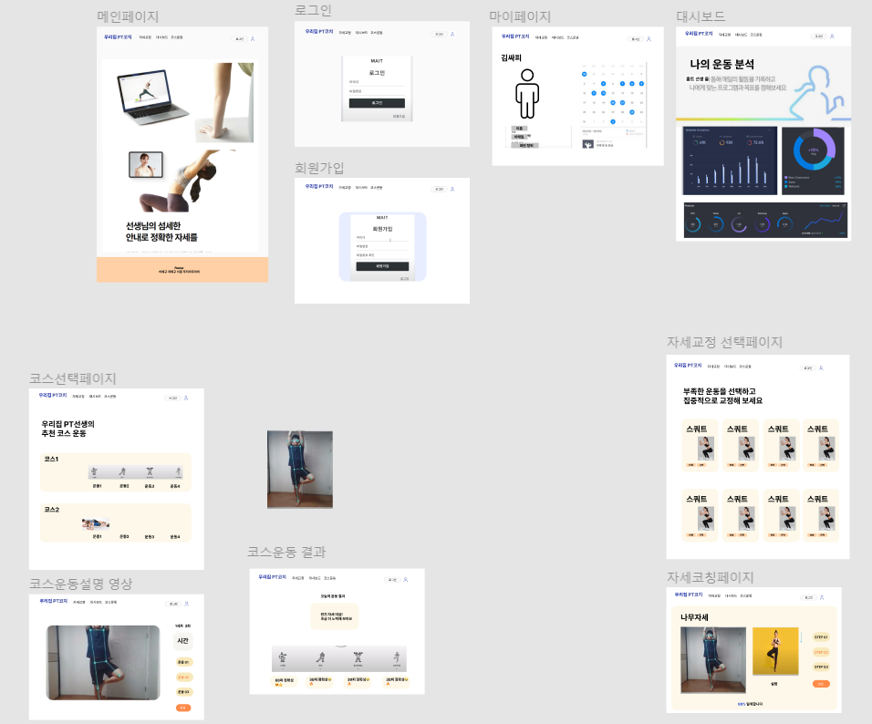

# 우리집PT코치

## 1. 프로젝트 소개

> 코로나 상황에 집에서 활력을 주면서, 혼자할 때의 부작용을 최소화할 수 있는 홈트레이닝 서비스를 기획했습니다.

- 우리집PT코치는 AI PT코치와 함께 운동하고, 운동 결과를 제공받는 서비스입니다.

## 2. 기능

- 메인 페이지
- 회원가입 및 로그인
- 코스 운동 선택 및 수행
- 자세 교정 선택 및 수행
- 대시보드
- 마이페이지

## 3. 개발환경

#### Front-end

- **Framework** : Vue.js
- **지원 환경** : Web
- **담당자** : 박세영, 심지영, 이연지

#### Back-end

- **Framework** : Spring boot
- **Database** : MySQL
- **담당자** : 김태헌, 류상오

#### TeachableMachine

- **담당자** : 김태헌, 류상오, 박세영

#### CI/CD

- **담당자** : 류상오

#### Design Resourses

- Logo

## 4. 핵심라이브러리

- Apexchart, v-calendar, teachablemachine

## 5. 기획 및 설계

- 기획(와이어프레임)

[Figma](https://www.figma.com/file/WCKaIrSg4paUCuEvHJI46W/pt%EC%84%A0%EC%83%9D-team-library?node-id=0%3A1)

- 설계(ERD)

[ERD Cloud에서 확인하기](https://www.erdcloud.com/d/qAooJZ72gMNWF4KL7)

- 설계(API)

[notion](https://gold-gum-efe.notion.site/API-1f2ec2625044473dbce5bed912fba88b)

